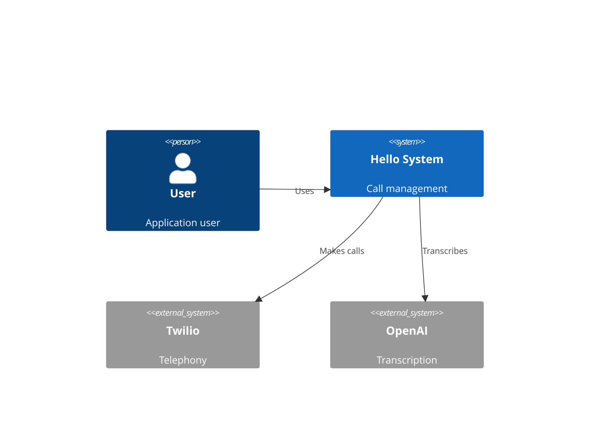
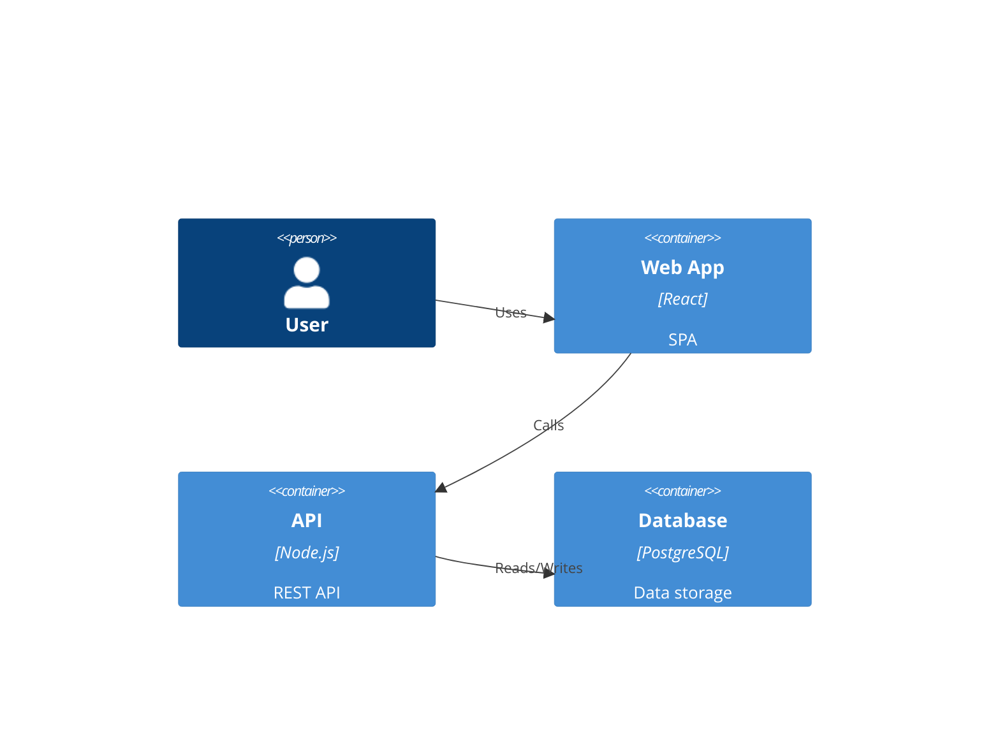

# C4 Architecture Diagrams

## Context Diagram

```mermaid
C4Context
    Person(user, "User", "Application user")
    System(hello, "Hello System", "Call management")
    System_Ext(twilio, "Twilio", "Telephony")
    System_Ext(openai, "OpenAI", "Transcription")

    Rel(user, hello, "Uses")
    Rel(hello, twilio, "Makes calls")
    Rel(hello, openai, "Transcribes")
```

## Container Diagram

```mermaid
C4Container
    Person(user, "User")
    Container(web, "Web App", "React", "SPA")
    Container(api, "API", "Node.js", "REST API")
    Container(db, "Database", "PostgreSQL", "Data storage")

    Rel(user, web, "Uses")
    Rel(web, api, "Calls")
    Rel(api, db, "Reads/Writes")
```
