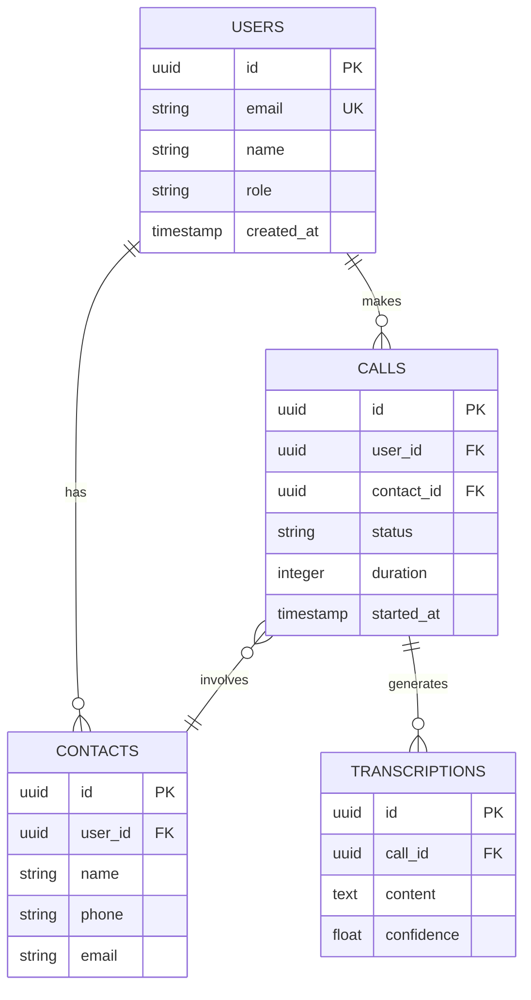

# Database ERD

```mermaid
erDiagram
    USERS ||--o{ CALLS : makes
    USERS ||--o{ CONTACTS : has
    CALLS }o--|| CONTACTS : involves
    CALLS ||--o{ TRANSCRIPTIONS : generates

    USERS {
        uuid id PK
        string email UK
        string name
        string role
        timestamp created_at
    }

    CALLS {
        uuid id PK
        uuid user_id FK
        uuid contact_id FK
        string status
        integer duration
        timestamp started_at
    }

    CONTACTS {
        uuid id PK
        uuid user_id FK
        string name
        string phone
        string email
    }

    TRANSCRIPTIONS {
        uuid id PK
        uuid call_id FK
        text content
        float confidence
    }
```
