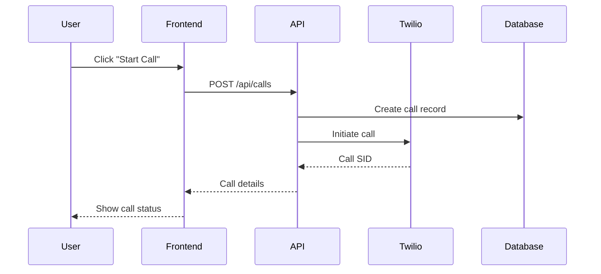
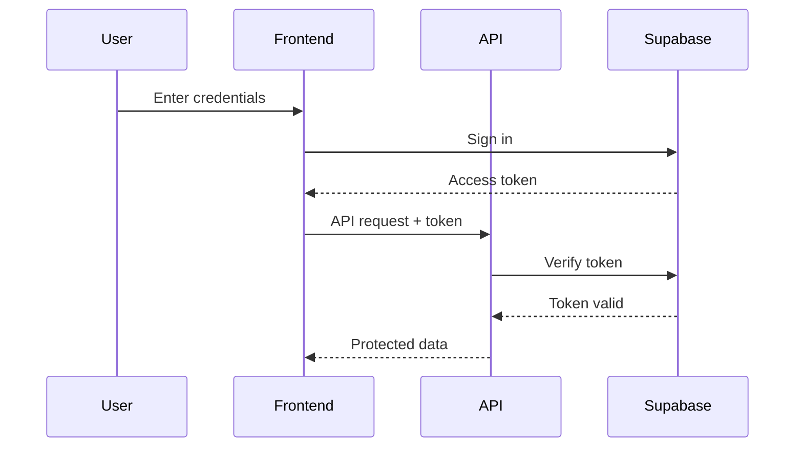

# Sequence Diagrams

## Call Flow

```mermaid
sequenceDiagram
    participant U as User
    participant F as Frontend
    participant A as API
    participant T as Twilio
    participant D as Database

    U->>F: Click "Start Call"
    F->>A: POST /api/calls
    A->>D: Create call record
    A->>T: Initiate call
    T-->>A: Call SID
    A-->>F: Call details
    F-->>U: Show call status
```

## Authentication Flow

```mermaid
sequenceDiagram
    participant U as User
    participant F as Frontend
    participant A as API
    participant S as Supabase

    U->>F: Enter credentials
    F->>S: Sign in
    S-->>F: Access token
    F->>A: API request + token
    A->>S: Verify token
    S-->>A: Token valid
    A-->>F: Protected data
```
